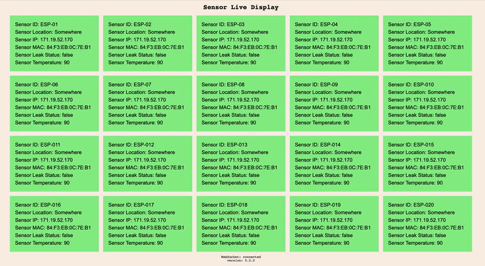

# Leak & Temperature Detector

## Overview
This project started out as a simple ESP8266 based leak detector that sends notifications by email. It has changed multiple times since the first iteration. The whole project was designed to accept as many sensors as needed and everything will scale automatically.

The sensors send out status messages to a mosquitto MQTT broker with the following information:

Sensor ID\
Sensor Location\
Sensor IP Address\
Sensor MAC Address\
Sensor Leak Status\
Sensor Temperature

There is also a node.js based http/websocket server that listens for updates on specified topics and sends updates to the websocket server with the same information in real time. The elements on the web page will change color based on status.

## Web View

## Todo
* Add ESP8266 schematic to README
